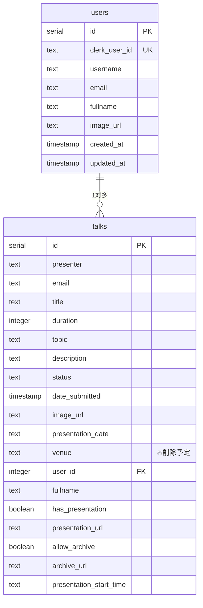
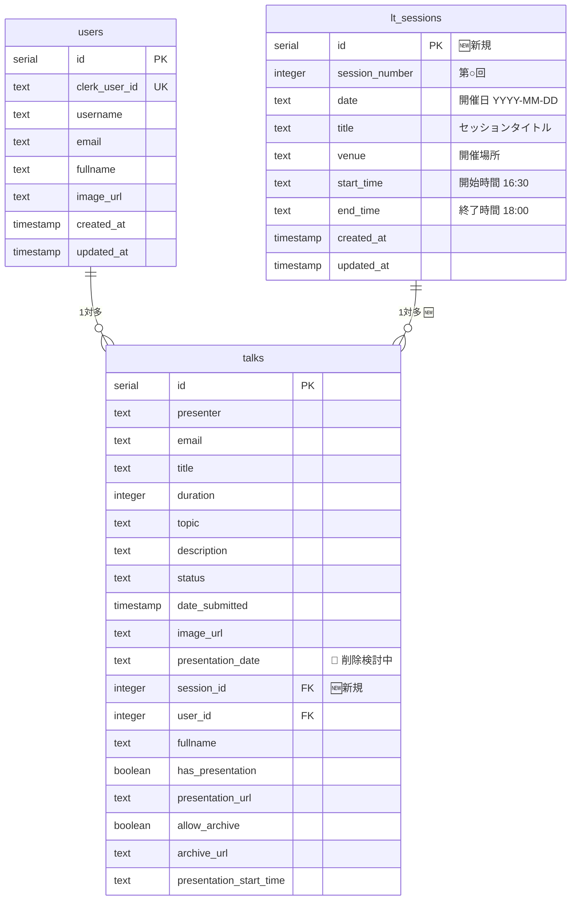

# データベース設計書

## 📊 現在のデータベース構造

### 現在の ERD



---

## 🚀 新しいデータベース構造（変更後）

### 新しい ERD



---

## 🔥 変更内容詳細

### 1. 新規テーブル: `lt_sessions`

```sql
CREATE TABLE "lt_sessions" (
  "id" serial PRIMARY KEY NOT NULL,
  "session_number" integer NOT NULL,
  "date" text NOT NULL,
  "title" text,
  "venue" text NOT NULL,
  "start_time" text NOT NULL DEFAULT '16:30',
  "end_time" text NOT NULL DEFAULT '18:00',
  "created_at" timestamp DEFAULT now(),
  "updated_at" timestamp DEFAULT now()
);
```

#### フィールド詳細

| カラム           | 型      | 制約     | 説明                                       |
| ---------------- | ------- | -------- | ------------------------------------------ |
| `id`             | serial  | PK       | 主キー                                     |
| `session_number` | integer | NOT NULL | 第 ○ 回（1, 2, 3...）                      |
| `date`           | text    | NOT NULL | 開催日 (YYYY-MM-DD)                        |
| `title`          | text    | NULL OK  | セッションタイトル（例：「新年 LT 大会」） |
| `venue`          | text    | NOT NULL | 開催場所                                   |
| `start_time`     | text    | NOT NULL | 開始時間（固定：16:30）                    |
| `end_time`       | text    | NOT NULL | 終了時間（固定：18:00）                    |

#### インデックス・制約

```sql
-- セッション番号のユニーク制約
CREATE UNIQUE INDEX "lt_sessions_session_number_unique" ON "lt_sessions"("session_number");

-- 日付インデックス（検索高速化）
CREATE INDEX "lt_sessions_date_idx" ON "lt_sessions"("date");
```

### 2. 既存テーブル修正: `talks`

#### 追加カラム

```sql
ALTER TABLE "talks" ADD COLUMN "session_id" integer;
ALTER TABLE "talks" ADD CONSTRAINT "talks_session_id_lt_sessions_id_fk"
    FOREIGN KEY ("session_id") REFERENCES "public"."lt_sessions"("id")
    ON DELETE SET NULL ON UPDATE NO ACTION;
```

#### 削除カラム（段階的）

```sql
-- フェーズ2で実行予定
-- ALTER TABLE "talks" DROP COLUMN "venue";
-- ALTER TABLE "talks" DROP COLUMN "presentation_date"; -- 検討中
```

#### 制約追加

```sql
-- セッションIDが設定されている場合の時間制限チェック
-- アプリケーション側で実装予定
```

---

## 📋 リレーション定義（Drizzle ORM）

### 新しいスキーマ定義

```typescript
// lt_sessions テーブル
export const ltSessions = pgTable("lt_sessions", {
  id: serial("id").primaryKey(),
  sessionNumber: integer("session_number").notNull().unique(),
  date: text("date").notNull(),
  title: text("title"),
  venue: text("venue").notNull(),
  startTime: text("start_time").notNull().default("16:30"),
  endTime: text("end_time").notNull().default("18:00"),
  createdAt: timestamp("created_at").defaultNow(),
  updatedAt: timestamp("updated_at").defaultNow(),
});

// talks テーブル（修正版）
export const talks = pgTable("talks", {
  // 既存フィールド...
  sessionId: integer("session_id").references(() => ltSessions.id, {
    onDelete: "set null",
  }),
  // venue: text("venue"), // 🔥削除予定
});

// リレーション定義
export const ltSessionsRelations = relations(ltSessions, ({ many }) => ({
  talks: many(talks),
}));

export const talksRelations = relations(talks, ({ one, many }) => ({
  user: one(users, {
    fields: [talks.userId],
    references: [users.id],
  }),
  session: one(ltSessions, {
    fields: [talks.sessionId],
    references: [ltSessions.id],
  }),
}));
```

---

## 🔄 マイグレーション計画

### マイグレーション 001: セッションテーブル追加

1. `lt_sessions`テーブル作成
2. インデックス・制約追加
3. 初期データ投入（現在の venue データから）

### マイグレーション 002: talks テーブル修正

1. `talks.session_id`カラム追加
2. 外部キー制約追加
3. 既存データの移行（venue → session 紐付け）

### マイグレーション 003: クリーンアップ（後日実行）

1. `talks.venue`カラム削除
2. 不要なインデックス削除

---

## 📊 データ移行戦略

### 既存データの処理

```sql
-- Step 1: 既存のvenue情報からセッション作成
INSERT INTO lt_sessions (session_number, date, venue, start_time, end_time)
SELECT DISTINCT
  ROW_NUMBER() OVER (ORDER BY presentation_date) as session_number,
  presentation_date as date,
  venue,
  '16:30' as start_time,
  '18:00' as end_time
FROM talks
WHERE presentation_date IS NOT NULL AND venue IS NOT NULL;

-- Step 2: talks テーブルのsession_id更新
UPDATE talks
SET session_id = (
  SELECT s.id
  FROM lt_sessions s
  WHERE s.date = talks.presentation_date
    AND s.venue = talks.venue
)
WHERE presentation_date IS NOT NULL AND venue IS NOT NULL;
```

---

## ⚠️ 制約・バリデーション

### アプリケーションレベル制約

1. **時間制限**: `presentation_start_time`は 16:30-18:00 内のみ
2. **セッション整合性**: session_id が設定されている場合、対応する session が存在する
3. **重複防止**: 同一 session 内で同じ開始時刻は不可

### データベースレベル制約

1. **セッション番号ユニーク**: `session_number`は重複不可
2. **外部キー**: session 削除時は talk.session_id を NULL に設定
3. **NOT NULL**: 必須フィールドの空値防止

---

## 🎯 想定されるクエリパターン

### よく実行されるクエリ

```sql
-- 1. 特定日のスケジュール取得（JOIN必須）
SELECT t.*, s.session_number, s.title, s.venue
FROM talks t
JOIN lt_sessions s ON t.session_id = s.id
WHERE s.date = '2024-01-15' AND t.status = 'approved'
ORDER BY t.presentation_start_time;

-- 2. 利用可能なセッション一覧
SELECT * FROM lt_sessions
WHERE date >= CURRENT_DATE
ORDER BY date;

-- 3. セッション別トーク数
SELECT s.*, COUNT(t.id) as talk_count
FROM lt_sessions s
LEFT JOIN talks t ON s.id = t.session_id AND t.status = 'approved'
GROUP BY s.id
ORDER BY s.date;
```

---

## 💾 パフォーマンス考慮事項

### インデックス戦略

- `lt_sessions.date`: 日付検索高速化
- `lt_sessions.session_number`: ユニーク制約 + 検索高速化
- `talks.session_id`: 外部キー + JOIN 高速化

### クエリ最適化

- セッション情報は比較的少ないデータなのでメモリキャッシュ可能
- 日付範囲検索が多いため、date フィールドのインデックス必須
- JOIN クエリが増えるため、適切なインデックス設計が重要
