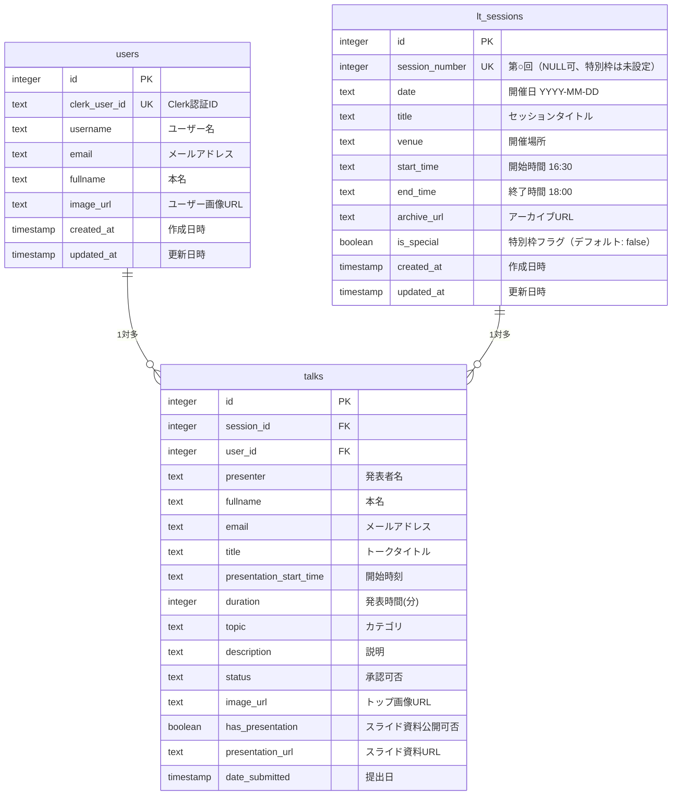

# データベース設計書

## ER 図



---

## テーブル詳細

### 1. ユーザーテーブル: `users`

```sql
CREATE TABLE "users" (
  "id" serial PRIMARY KEY NOT NULL,
  "clerk_user_id" text NOT NULL,
  "username" text,
  "email" text,
  "fullname" text,
  "image_url" text,
  "created_at" timestamp DEFAULT now(),
  "updated_at" timestamp DEFAULT now()
);
```

#### users テーブルのフィールド詳細

| カラム          | 型        | 制約             | 説明                            |
| --------------- | --------- | ---------------- | ------------------------------- |
| `id`            | integer   | PK, SERIAL       | 主キー（自動採番）              |
| `clerk_user_id` | text      | NOT NULL, UNIQUE | Clerk 認証サービスのユーザー ID |
| `username`      | text      | NULL OK          | ユーザー名                      |
| `email`         | text      | NULL OK          | メールアドレス                  |
| `fullname`      | text      | NULL OK          | 本名（ハッシュ化して保存）      |
| `image_url`     | text      | NULL OK          | プロフィール画像 URL            |
| `created_at`    | timestamp | DEFAULT now()    | レコード作成日時                |
| `updated_at`    | timestamp | DEFAULT now()    | レコード更新日時                |

#### users テーブルのインデックス・制約

```sql
-- 主キー
CREATE UNIQUE INDEX "users_pkey" ON "users"("id");

-- Clerk認証IDのユニーク制約
CREATE UNIQUE INDEX "users_clerk_user_id_unique" ON "users"("clerk_user_id");
```

### 2. セッションテーブル: `lt_sessions`

```sql
CREATE TABLE "lt_sessions" (
  "id" serial PRIMARY KEY NOT NULL,
  "session_number" integer,
  "date" text NOT NULL,
  "title" text,
  "venue" text NOT NULL,
  "start_time" text NOT NULL DEFAULT '16:30',
  "end_time" text NOT NULL DEFAULT '18:00',
  "archive_url" text,
  "is_special" boolean NOT NULL DEFAULT false,
  "created_at" timestamp DEFAULT now(),
  "updated_at" timestamp DEFAULT now()
);
```

#### lt_sessions テーブルのフィールド詳細

| カラム           | 型        | 制約          | 説明                                       |
| ---------------- | --------- | ------------- | ------------------------------------------ |
| `id`             | integer   | PK, SERIAL    | 主キー（自動採番）                         |
| `session_number` | integer   | NULL OK, UK   | 第 ○ 回（1, 2, 3...）。特別枠は未設定        |
| `date`           | text      | NOT NULL      | 開催日 (YYYY-MM-DD)                        |
| `title`          | text      | NULL OK       | セッションタイトル（例：「新年 LT 大会」） |
| `venue`          | text      | NOT NULL      | 開催場所                                   |
| `start_time`     | text      | NOT NULL      | 開始時間（デフォルト：16:30）              |
| `end_time`       | text      | NOT NULL      | 終了時間（デフォルト：18:00）              |
| `archive_url`    | text      | NULL OK       | セッション全体のアーカイブ URL             |
| `is_special`     | boolean   | NOT NULL      | 特別枠フラグ（true で番号は未設定）        |
| `created_at`     | timestamp | DEFAULT now() | レコード作成日時                           |
| `updated_at`     | timestamp | DEFAULT now() | レコード更新日時                           |

#### lt_sessions テーブルのインデックス・制約

```sql
-- 主キー
CREATE UNIQUE INDEX "lt_sessions_pkey" ON "lt_sessions"("id");

-- セッション番号のユニーク制約
CREATE UNIQUE INDEX "lt_sessions_session_number_unique" ON "lt_sessions"("session_number");

-- 日付インデックス（検索高速化）
CREATE INDEX "lt_sessions_date_idx" ON "lt_sessions"("date");
```

補足: PostgreSQL の UNIQUE 制約は NULL を複数許容するため、`session_number` が NULL の特別枠は重複扱いになりません。

### 3. トークテーブル: `talks`

```sql
CREATE TABLE "talks" (
  "id" serial PRIMARY KEY NOT NULL,
  "presenter" text NOT NULL,
  "email" text,
  "title" text NOT NULL,
  "duration" integer NOT NULL,
  "topic" text NOT NULL,
  "description" text,
  "status" text DEFAULT 'pending',
  "date_submitted" timestamp DEFAULT now(),
  "image_url" text,
  "session_id" integer,
  "user_id" integer,
  "fullname" text,
  "has_presentation" boolean DEFAULT false,
  "presentation_url" text,
  "presentation_start_time" text
);
```

#### talks テーブルのフィールド詳細

| カラム                    | 型        | 制約          | 説明                                         |
| ------------------------- | --------- | ------------- | -------------------------------------------- |
| `id`                      | integer   | PK, SERIAL    | 主キー（自動採番）                           |
| `presenter`               | text      | NOT NULL      | 発表者名（表示名）                           |
| `email`                   | text      | NULL OK       | メールアドレス                               |
| `title`                   | text      | NOT NULL      | トークタイトル                               |
| `duration`                | integer   | NOT NULL      | 発表時間（分）                               |
| `topic`                   | text      | NOT NULL      | カテゴリ（例：技術、キャリア等）             |
| `description`             | text      | NULL OK       | トークの説明                                 |
| `status`                  | text      | DEFAULT       | 承認ステータス（pending/approved/rejected）  |
| `date_submitted`          | timestamp | DEFAULT now() | トーク提出日時                               |
| `image_url`               | text      | NULL OK       | トップ画像 URL                               |
| `session_id`              | integer   | FK, NULL OK   | セッション ID（lt_sessions.id への外部キー） |
| `user_id`                 | integer   | FK, NULL OK   | ユーザー ID（users.id への外部キー）         |
| `fullname`                | text      | NULL OK       | 本名（トーク作成時のスナップショット）       |
| `has_presentation`        | boolean   | DEFAULT false | スライド資料公開可否                         |
| `presentation_url`        | text      | NULL OK       | スライド資料 URL                             |
| `presentation_start_time` | text      | NULL OK       | 発表開始時刻（HH:MM 形式）                   |

#### talks テーブルのインデックス・制約

```sql
-- 主キー
CREATE UNIQUE INDEX "talks_pkey" ON "talks"("id");

-- 外部キー制約
ALTER TABLE "talks"
  ADD CONSTRAINT "talks_session_id_lt_sessions_id_fk"
  FOREIGN KEY ("session_id") REFERENCES "lt_sessions"("id")
  ON DELETE SET NULL;

ALTER TABLE "talks"
  ADD CONSTRAINT "talks_user_id_users_id_fk"
  FOREIGN KEY ("user_id") REFERENCES "users"("id");
```

---

## リレーション詳細

### `users` → `talks` (1 対多)

- 1 人のユーザーが複数のトークを登録可能
- `talks.user_id` が `users.id` を参照
- ユーザー削除時は別途アプリケーション側で制御

### `lt_sessions` → `talks` (1 対多)

- 1 つのセッションに複数のトークが紐付く
- `talks.session_id` が `lt_sessions.id` を参照
- セッション削除時は `talks.session_id` が NULL に設定される（ON DELETE SET NULL）

---

## データ整合性ルール
### セッション登録ルール

1. 特別枠（`is_special = true`）の場合:
   - `session_number` は設定しない（NULL）
   - `title` が空の場合は自動で「`{date} 特別枠`」を保存
2. 通常枠（`is_special = false`）の場合:
   - `session_number` は必須、他レコードと重複不可（409）
3. 一覧表示:
   - 特別枠は「特別枠」と表示し、通常枠は「第{session_number}回」

### トーク登録時のバリデーション

1. `presentation_start_time` は必須フィールド
2. 発表開始時刻はセッションの `start_time` から `end_time` の範囲内である必要がある
3. `session_id` が指定された場合、該当セッションが存在する必要がある

### ステータス管理

- **pending**: 提出済み、承認待ち（デフォルト）
- **approved**: 承認済み（スケジュールに表示される）
- **rejected**: 却下

---

## テーブルサイズ情報（参考値）

| テーブル    | テーブルサイズ | インデックスサイズ | 合計サイズ |
| ----------- | -------------- | ------------------ | ---------- |
| users       | 8 KB           | 40 KB              | 48 KB      |
| lt_sessions | 8 KB           | 56 KB              | 64 KB      |
| talks       | 16 KB          | 48 KB              | 64 KB      |
